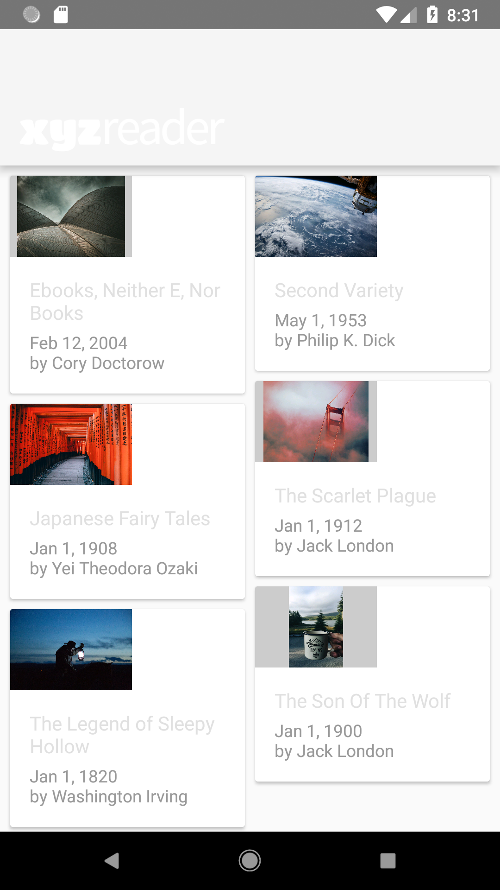
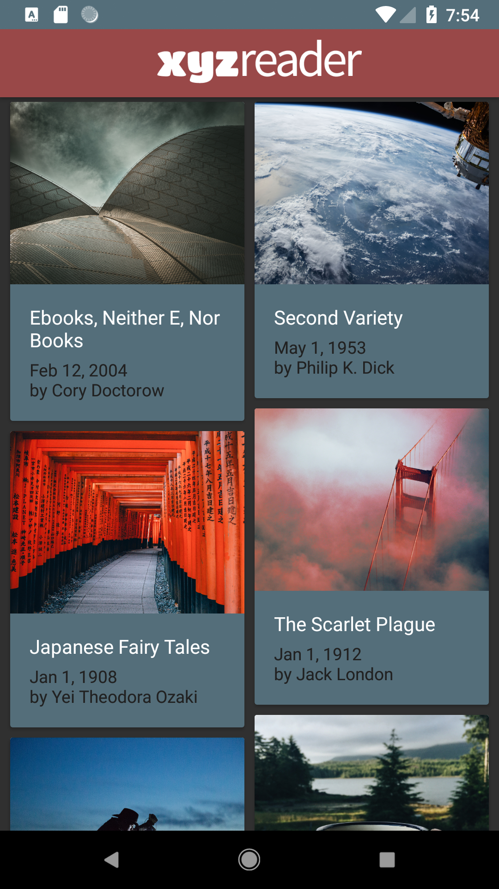

# Make your App Material Repository

## About 
This repository was created to host a project that is part of *Udacity Developing Android Apps Nanodegree* program. [Here](https://github.com/udacity/xyz-reader-starter-code) you can find the starter code. And [here](https://review.udacity.com/#!/rubrics/63/view) you can find the rubrics of this project.

## Why
This project aim's to take a working application and working on it's UI and applying the Material Design guidelines to make the app beautiful. Before applying any modification to the UI the app looks like in the photo bellow.

## Results

(**work in progress**)

